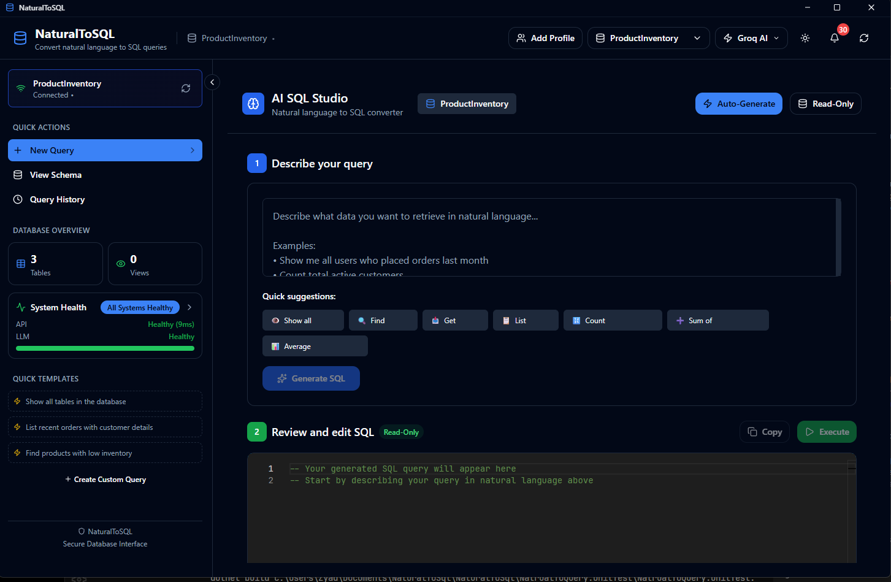
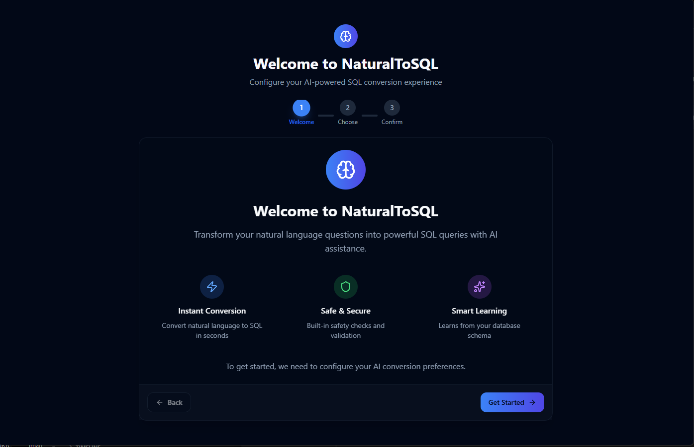
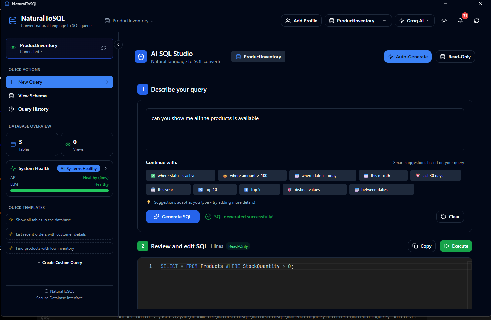
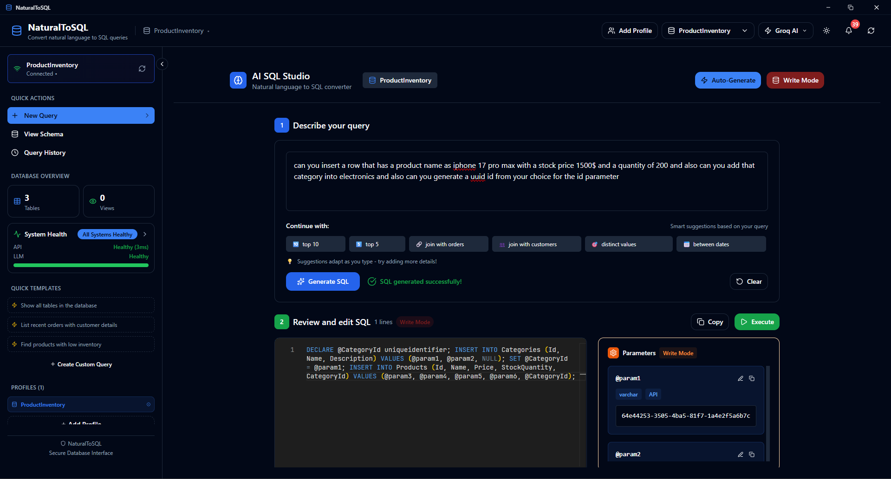
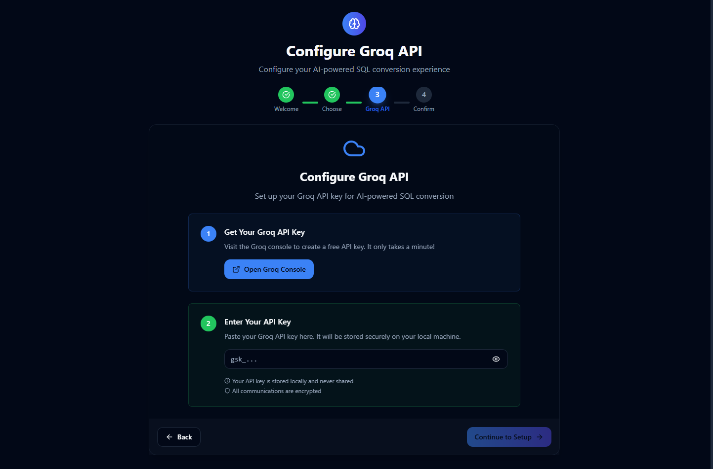

# NaturalToSQL 🚀

[](https://dotnet.microsoft.com/download/dotnet/9.0)
[](https://reactjs.org/)
[](https://opensource.org/licenses/MIT)
[]()

**Transform natural language into SQL queries with AI-powered intelligence**

NaturalToSQL is a comprehensive desktop application that leverages advanced AI models to convert natural language queries into precise SQL statements. Built with modern .NET architecture and featuring both web and desktop interfaces, it provides seamless database interaction for developers, analysts, and database administrators.

## 📸 Screenshots

### Main Application Interface


### Setup Process


### Query Generation in Action


### Complex Query Handling


## ✨ Key Features

### 🤖 **AI-Powered Query Generation**
- **Multiple AI Backends**: Support for Groq API, Local LLM (Ollama), and Basic mode
- **Intelligent SQL Generation**: Context-aware query generation with schema validation
- **Parameter Handling**: Automatic parameterization for SQL injection protection
- **Complex Query Support**: Handles joins, aggregations, subqueries, and advanced SQL patterns

### 🗄️ **Database Support**
- **SQL Server Integration**: Full support with automatic server discovery
- **Schema Discovery**: Real-time database schema extraction and caching
- **Connection Management**: Secure credential storage using Windows Credential Store
- **Query History**: Persistent storage of query execution history

### 🔒 **Security & Performance**
- **Rate Limiting**: 100 requests/minute per IP protection
- **Memory Caching**: Intelligent caching for query results and schema data
- **Parameterized Queries**: Built-in SQL injection protection
- **Execution Modes**: Read-only and write operation controls

### 🖥️ **Multiple Interfaces**
- **Desktop Application**: Feature-rich Electron app with Monaco editor
- **Web Interface**: React-based web application
- **REST API**: Comprehensive API for integration and automation

### 📊 **Advanced Features**
- **Profile Management**: Multiple database connection profiles
- **Health Monitoring**: Real-time system health checks
- **Query Analytics**: Detailed execution metrics and performance data
- **Export Capabilities**: Query result export in multiple formats

## 🏗️ Architecture

NaturalToSQL follows **Clean Architecture** principles with clear separation of concerns:

```
┌─────────────────────────────────────────────────────────────┐
│                    Presentation Layer                       │
│  ┌─────────────┐  ┌─────────────┐  ┌─────────────────────┐  │
│  │   Web API   │  │  React Web  │  │   Electron Desktop  │  │
│  │FastEndpoints│  │     App     │  │        App          │  │
│  └─────────────┘  └─────────────┘  └─────────────────────┘  │
└─────────────────────────────────────────────────────────────┘
┌──────────────────────────────────────────────────────────────┐
│                   Application Layer                          │
│  ┌─────────────────────────────────────────────────────────┐ │
│  │  Services: Profile, QueryOrchestration, Setup, etc.     │ │
│  └─────────────────────────────────────────────────────────┘ │
└──────────────────────────────────────────────────────────────┘
┌─────────────────────────────────────────────────────────────┐
│                  Infrastructure Layer                       │
│  ┌─────────────┐  ┌─────────────┐  ┌─────────────────────┐  │
│  │     LLM     │  │  Database   │  │      Caching        │  │
│  │  Services   │  │  Providers  │  │   & Persistence     │  │
│  └─────────────┘  └─────────────┘  └─────────────────────┘  │
└─────────────────────────────────────────────────────────────┘
┌───────────────────────────────────────────────────────────────┐
│                      Core Domain                              │
│  ┌─────────────────────────────────────────────────────────┐  │
│  │   Entities: Profile, Query, UserInfo                    │  │
│  │   Domain Events, Specifications, Business Rules         │  │
│  └─────────────────────────────────────────────────────────┘  │
└───────────────────────────────────────────────────────────────┘
```

## 🚀 Quick Start

### Prerequisites

- **.NET 9.0 SDK** or later
- **Node.js 18+** (for frontend development)
- **SQL Server** (any edition)
- **Visual Studio 2022** or **VS Code** (recommended)

### 1. Clone the Repository

```bash
git clone https://github.com/ahmedashraf0001/NatrualToSql.git
cd NatrualToSql
```

### 2. Backend Setup

```bash
# Restore NuGet packages
dotnet restore

# Build the solution
dotnet build

# Run the API
cd NaturalToSql
dotnet run
```

The API will be available at:
- **HTTPS**: `https://localhost:7202`
- **HTTP**: `http://localhost:5000`

### 3. Frontend Setup

#### Option A: Desktop Application (Recommended)

```bash
cd NaturalToSql.UI/db-ql-ui
npm install
npm start
```

#### Option B: Web Application

```bash
cd NaturalToSql.UI/naturaltosql
npm install
npm start
```

### 4. Configuration

1. **Configure AI Provider**: Choose between Groq API, Local LLM, or Basic mode
2. **Setup Database Connection**: Add your SQL Server connection details
3. **Create Profile**: Configure your first database profile



## 📋 API Documentation

### Base URLs
- **Production**: `https://localhost:7202`
- **Development**: `http://localhost:5000`

### Core Endpoints

#### Health Check
```http
GET /api/health
```

**Response:**
```json
{
  "status": "Healthy",
  "timestamp": "2024-01-15T10:30:00Z"
}
```

#### Create Database Profile
```http
POST /api/setup/profile
```

**Request:**
```json
{
  "connectionType": "AutoConnect",
  "providerType": "SqlServer",
  "serverName": "DESKTOP-QCK8UI5\\SQLEXPRESS",
  "databaseName": "ProductInventory"
}
```

**Response:**
```json
{
  "profileId": "d290f1ee-6c54-4b01-90e6-d701748f0851",
  "success": true
}
```

#### Convert Natural Language to SQL
```http
POST /api/query/{profileId}/convert
```

**Request:**
```json
{
  "profileId": "d290f1ee-6c54-4b01-90e6-d701748f0851",
  "query": "Show all products with price above 100",
  "allowWriteOperations": false
}
```

**Response:**
```json
{
  "sql": "SELECT * FROM Products WHERE Price > @price",
  "intent": "FILTER+SELECT",
  "intent_components": ["FILTER", "SELECT"],
  "tables": ["Products"],
  "columns": ["Products.Price"],
  "parameters": [
    {
      "name": "@price",
      "value": "100",
      "source_text": "100"
    }
  ],
  "confidence": 95,
  "safe": true,
  "issues": [],
  "explanation": "Filtering products by price greater than 100"
}
```

#### Complex Query Example

**Natural Language Input:**
> "Show me the top 5 customers by total order value in 2024, including their contact information and the number of orders they placed, but only for customers who have placed more than 3 orders"

**Request:**
```json
{
  "profileId": "d290f1ee-6c54-4b01-90e6-d701748f0851",
  "query": "Show me the top 5 customers by total order value in 2024, including their contact information and the number of orders they placed, but only for customers who have placed more than 3 orders",
  "allowWriteOperations": false
}
```

**Response:**
```json
{
  "sql": "SELECT TOP 5 c.CustomerId, c.CustomerName, c.Email, c.Phone, COUNT(o.OrderId) AS OrderCount, SUM(o.TotalAmount) AS TotalOrderValue FROM Customers c INNER JOIN Orders o ON c.CustomerId = o.CustomerId WHERE YEAR(o.OrderDate) = @year GROUP BY c.CustomerId, c.CustomerName, c.Email, c.Phone HAVING COUNT(o.OrderId) > @minOrders ORDER BY SUM(o.TotalAmount) DESC",
  "intent": "AGGREGATE+JOIN+FILTER+GROUP_BY+HAVING+ORDER_BY",
  "intent_components": ["SELECT", "JOIN", "WHERE", "GROUP_BY", "HAVING", "ORDER_BY", "AGGREGATE"],
  "tables": ["Customers", "Orders"],
  "columns": [
    "Customers.CustomerId", 
    "Customers.CustomerName", 
    "Customers.Email", 
    "Customers.Phone",
    "Orders.CustomerId",
    "Orders.OrderId", 
    "Orders.TotalAmount", 
    "Orders.OrderDate"
  ],
  "parameters": [
    {
      "name": "@year",
      "value": "2024",
      "source_text": "2024"
    },
    {
      "name": "@minOrders",
      "value": "3",
      "source_text": "more than 3 orders"
    }
  ],
  "confidence": 92,
  "safe": true,
  "issues": [],
  "explanation": "Complex query with JOIN between Customers and Orders tables, filtering by year 2024, grouping by customer details, applying HAVING clause for order count > 3, and ordering by total order value descending with TOP 5 limit."
}
```

#### Execute SQL Query
```http
POST /api/query/{profileId}/execute
```

**Request:**
```json
{
  "profileId": "d290f1ee-6c54-4b01-90e6-d701748f0851",
  "sql": "SELECT * FROM Products WHERE Price > @price",
  "userQuery": "Show all products with price above 100",
  "parameters": { "price": 100 },
  "mode": "ReadOnly"
}
```

**Response:**
```json
{
  "columns": ["ProductId", "Name", "Price"],
  "rows": [
    [1, "Laptop", 1200],
    [2, "Phone", 800]
  ],
  "executionMs": 45,
  "affectedRows": 2,
  "success": true
}
```

For complete API documentation, see [API Reference](docs/api-reference.md).

## 🔧 Configuration

### Application Settings

```json
{
  "Groq": {
    "BaseGroqUrl": "https://api.groq.com",
    "BaseLocalLLMUrl": "http://localhost:11434",
    "GroqModel": "llama-3.3-70b-versatile",
    "LocalModel": "qwen3:8b"
  },
  "ConnectionStrings": {
    "DefaultConnection": "Data Source=schema_cache.db"
  },
  "SupportDBs": [
    {
      "dbType": "SqlServer",
      "Name": "SQL Server",
      "BaseKey": "SOFTWARE\\Microsoft\\Microsoft SQL Server\\Instance Names\\SQL"
    }
  ]
}
```

### Environment Variables

| Variable | Description | Default |
|----------|-------------|---------|
| `GROQ_API_KEY` | Groq API key for cloud LLM | - |
| `LOCAL_LLM_URL` | Local LLM endpoint | `http://localhost:11434` |
| `LOG_LEVEL` | Logging level | `Information` |

## 🧪 Testing

### Running Unit Tests

```bash
# Run all tests
dotnet test

# Run with coverage
dotnet test --collect:"XPlat Code Coverage"

# Run specific test project
dotnet test NatrualToQuery.UnitTest
```

### Test Structure

- **Unit Tests**: Service layer testing with comprehensive mocking
- **Integration Tests**: End-to-end API testing
- **Test Containers**: Automated SQL Server testing environment

### Test Coverage

The project maintains high test coverage across:
- ✅ Application Services (95%+)
- ✅ Domain Logic (90%+)
- ✅ API Endpoints (85%+)
- ✅ Database Providers (80%+)

## 🔐 Security

### Built-in Security Features

- **SQL Injection Protection**: Automatic parameterization
- **Rate Limiting**: Request throttling per IP address
- **Credential Security**: Windows Credential Store integration
- **Input Validation**: Comprehensive request validation
- **Execution Mode Controls**: Read-only vs write operation separation

### Security Best Practices

1. **Never expose API keys** in client-side code
2. **Use HTTPS** in production environments
3. **Regularly rotate** API keys and credentials
4. **Monitor query patterns** for suspicious activity
5. **Limit write operations** to authorized users only

## 🚢 Deployment

### Docker Deployment

```dockerfile
# Build stage
FROM mcr.microsoft.com/dotnet/sdk:9.0 AS build
WORKDIR /src
COPY . .
RUN dotnet restore
RUN dotnet build -c Release -o /app/build

# Runtime stage
FROM mcr.microsoft.com/dotnet/aspnet:9.0 AS runtime
WORKDIR /app
COPY --from=build /app/build .
EXPOSE 80
EXPOSE 443
ENTRYPOINT ["dotnet", "NaturalToQuery.Api.dll"]
```

### Desktop Application Distribution

```bash
# Build desktop application
cd NaturalToSql.UI/db-ql-ui
npm run build:app

# Outputs:
# - Windows: NaturalToSQL-Setup-1.0.0.exe
# - Portable: NaturalToSQL-Portable-1.0.0.exe
```

## 🤝 Contributing

We welcome contributions! Please see our [Contributing Guidelines](CONTRIBUTING.md) for details.

### Development Setup

1. **Fork** the repository
2. **Create** a feature branch: `git checkout -b feature/amazing-feature`
3. **Commit** your changes: `git commit -m 'Add amazing feature'`
4. **Push** to the branch: `git push origin feature/amazing-feature`
5. **Open** a Pull Request

### Code Style

- Follow **C# coding conventions**
- Use **meaningful variable names**
- Add **XML documentation** for public APIs
- Include **unit tests** for new features
- Follow **Clean Architecture** principles

## 🗺️ Roadmap

### Version 2.0 (Q1 2025)
- [ ] **PostgreSQL Support** - Extended database compatibility
- [ ] **MySQL Integration** - Additional database provider
- [ ] **Advanced Analytics** - Query performance insights
- [ ] **Collaboration Features** - Team query sharing

### Version 2.1 (Q2 2025)
- [ ] **Cloud Deployment** - Azure/AWS deployment templates
- [ ] **Advanced AI Models** - GPT-4 integration
- [ ] **Query Optimization** - AI-powered query improvement suggestions
- [ ] **Audit Logging** - Comprehensive activity tracking

### Version 3.0 (Q3 2025)
- [ ] **Multi-tenant Architecture** - Enterprise support
- [ ] **Custom Model Training** - Domain-specific AI models
- [ ] **Advanced Visualizations** - Query result charts and graphs
- [ ] **API Gateway Integration** - Enterprise authentication

## 📊 Performance Metrics

### Benchmark Results

| Operation | Average Time | 95th Percentile |
|-----------|--------------|-----------------|
| Query Generation | 1.2s | 2.1s |
| Schema Caching | 45ms | 120ms |
| Query Execution | 180ms | 350ms |
| Profile Creation | 250ms | 400ms |

### System Requirements

**Minimum:**
- **OS**: Windows 10, macOS 10.14, Ubuntu 18.04
- **RAM**: 4GB
- **Storage**: 500MB
- **Network**: Internet connection for AI services

**Recommended:**
- **OS**: Windows 11, macOS 12+, Ubuntu 20.04+
- **RAM**: 8GB+
- **Storage**: 2GB
- **CPU**: Multi-core processor

## 🆘 Support

### Getting Help

- 📖 **Documentation**: [Wiki](https://github.com/ahmedashraf0001/NatrualToSql/wiki)
- 🐛 **Bug Reports**: [Issues](https://github.com/ahmedashraf0001/NatrualToSql/issues)
- 💬 **Discussions**: [GitHub Discussions](https://github.com/ahmedashraf0001/NatrualToSql/discussions)
- 📧 **Email**: support@naturaltosql.com

### Troubleshooting

#### Common Issues

**Q: LLM service returns errors**
```bash
# Check health endpoint
curl https://localhost:7202/api/health

# Verify API key configuration
# Check logs in: logs/log-{date}.txt
```

**Q: Database connection fails**
```bash
# Test SQL Server connection
sqlcmd -S "YourServer" -E

# Verify Windows Authentication
# Check credential store access
```

**Q: Desktop app won't start**
```bash
# Check Node.js version
node --version  # Should be 18+

# Reinstall dependencies
npm install
npm start
```

## 📄 License

This project is licensed under the **MIT License** - see the [LICENSE](LICENSE) file for details.

## 🙏 Acknowledgments

- **Groq** for providing high-performance LLM APIs
- **Ollama** for local LLM infrastructure
- **Microsoft** for .NET framework and development tools
- **React Community** for frontend framework and components
- **Electron** for cross-platform desktop application framework

## 📈 Statistics


---

**Made with ❤️ by the NaturalToSQL Team**

*Transform your database interactions with the power of AI*
